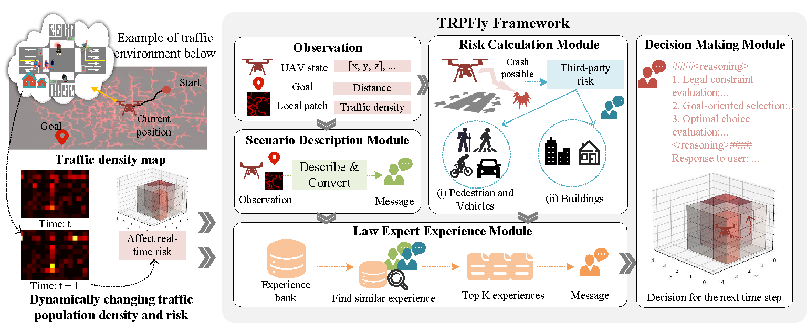

# TPRFly: LLM-based Third-Party Risk-Aware Decision-Making for UAVs in Dynamic Traffic Environments
[arXiv]() | [paper]() | [website]()\
This repository is the official implementation of TPRFly.
TPRFly is a third-party risk-aware decision-making framework for UAVs operating in complex urban environments characterized by dense traffic flows and buildings.

<div style="text-align:center;">

</div>


## Table of Contents
+ [Setup](#setup)
+ [Datasets](#datasets)
+ [Experiments](#experiments)
+ [Acknowledgements](#acknowledgements)

## Setup
Clone the repository and set up the environment:
```
git clone https://github.com/SAS-HKU/TPRFly.git
cd TPRfly
conda create --name tprfly python==3.9
conda activate tprfly
pip install -r requirement.txt
```
*Note:* For compatibility, you may experiment with different pytorch versions. We use PyTorch 1.12.1 with cu113.

## Datasets


## Experiments


## TODO LIST

- [x] Introduction & DEMO
- [ ] Datasets
- [ ] Code
- [ ] Visualizations


## Acknowledgements

## Citation